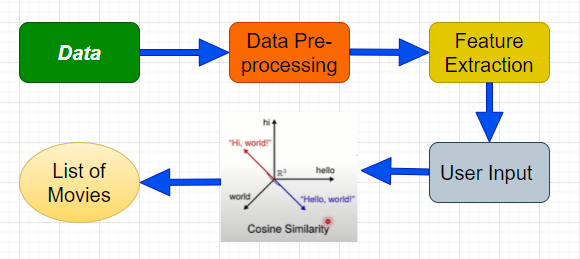
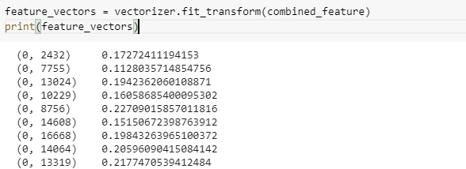
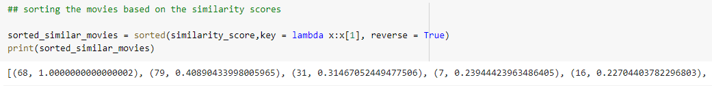
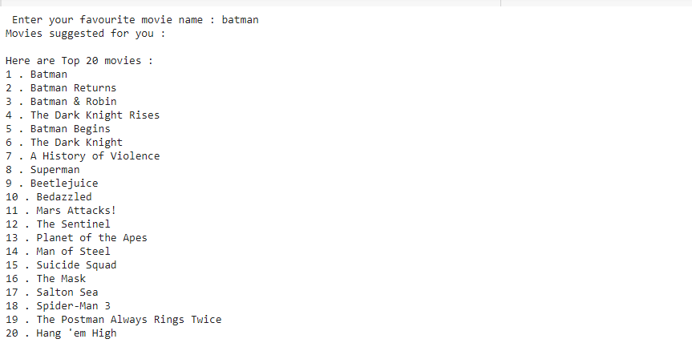

# Movie-Recommendation-System

#### In this experiment I have implemented a movies recommendation system using machine lerarning.

## Problem Statement 

  The problem statement is something like the user should gives any movies name and they will get a list of movies name based on their choice.
  
## Recommendation System 
    
   Recommendation system can be categorized into 3 parts :
    
    1. Content Based Recommendation System : Based on the content of the movies it groups the similar movies .
    
    2. Popularity Based Recommendation System : Based on the popularity of the movies or the reviews of the users it groups the similar movies .
    
    3. Collaborative Based Recommendation System : Tt groups the similar movies based on the watching pattern of the users.
    
## Flowchart 

##  ## Procedure followed for this experiment:
    
### 1. Dataset loading and preprocessing of dataset:

       * Importing different libraries like numpy, pandas, sklearn etc.
       * Verifying the null values in the dataset.
       * Replacing null values with empty strings.
       
### 2. Feature Engineeering: 

  #### In the dataset we have 24 columns but we will use some relevent columns like genres, keywords, tagline, cast, director
  
       * Replacing null values with the empty strings for the selected columns.
       * Combining all the features with a space.
### 3. TfidfVectorizer:
       
       * Converting the text data into feature vectores using TfidfVectorizer.
       
   
   
### 4. Cosine Similarity: 

   #### Cosine similarity is the cosine of the angle between two n-dimensional vectors in an n-dimensional space. It is the dot product of the two vectors divided by the product of the two vectors' lengths (or magnitudes).
   #### To know more [refer](https://en.wikipedia.org/wiki/Cosine_similarity).
   
      * To find the similarity scores between the words I used cosine similarity.
      * Then for a particular movie name I found out the close matches using the difflib library.
      * Then I found out index of similar movies and their corresponding similarity score of that particular movie name.
      
   
   
      * Finally I got the corresponding movie names according to the movie name given.
      

 ### 5. Testing : 
 
   
   
   
   
#### Thanks!!!
    

